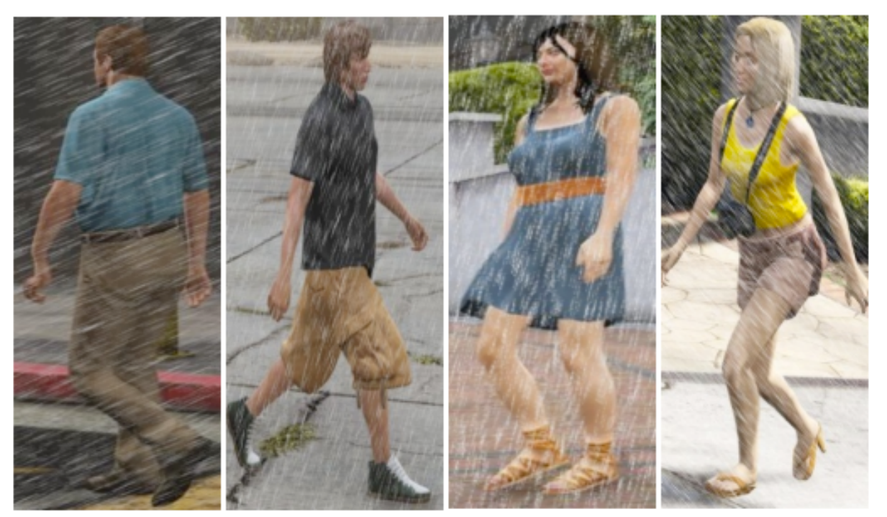

# VC-Clothes-W&R Introduction
##  To enhance the diversity of the image backgrounds and increase the model’s robustness, we add wind and rain scenes to the VC-Clothes dataset [1] and some sample images are shown in Fig.1. The generated VC-Clothes-W&R dataset consists of images captured from four different cameras, segmented into training and testing sets. The training set comprises 256 unique identities with a total of 9,449 images. Similarly, the test set is structured into query and gallery segments, maintaining the same 256 identities with 1,020 images in the query and 8,591 in the gallery set. 

    

Fig.1 Some images from VC-Clothes-W&R

dataset : https://pan.baidu.com/s/1TSOGrb4ZTcBiS_6ztAkEJA?pwd=ct9f 
 
[1] Y. Huang, J. Xu, Q. Wu, Y. Zhong, P. Zhang, Z. Zhang, Beyond scalar neuron: Adopting
vector-neuron capsules for long-term person re-identification, IEEE TCSVT 30 (2019)
3459–3471.
